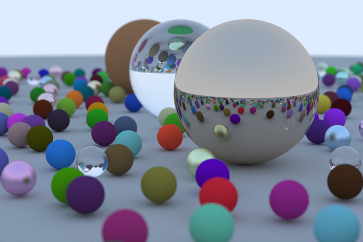
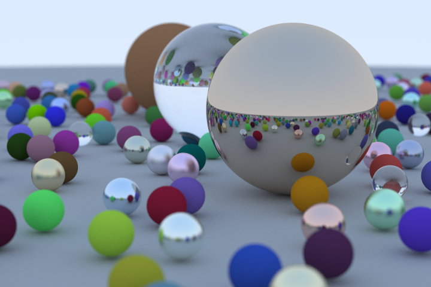
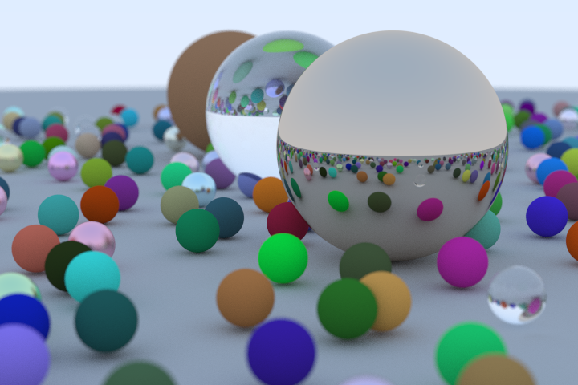
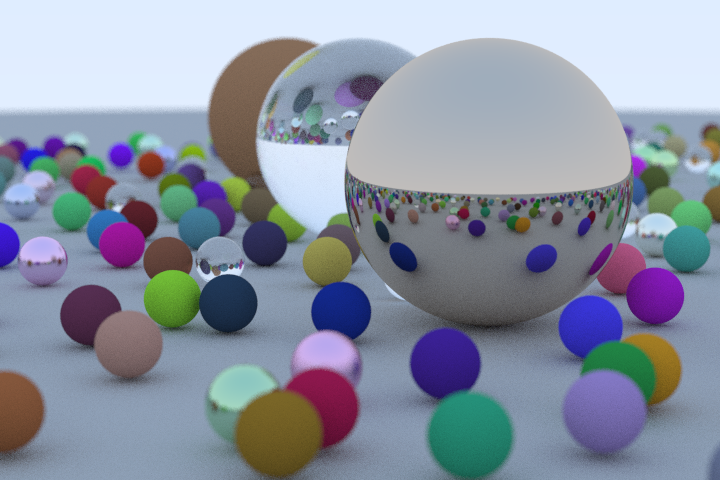

# Julia Ray Tracing in One Weekend

All the code in the main directory is partially not working because of the incremental improvement on this code, the working one generate a .ppm file that is a simple way of representing an image and can be viewed at https://www.cs.rhodes.edu/welshc/COMP141_F16/ppmReader.html 

Final render of the scene for the raytracer with 500 samples per pixel and 50 of max depth using Struct:

Final render of the scene for the raytracer with 500 samples per pixel and 50 of max depth using SVectors:

Final render of the scene for the raytracer with 500 samples per pixel and 50 of max depth:

Final render of the scene for the raytracer with 100 samples per pixel and 50 of max depth:

